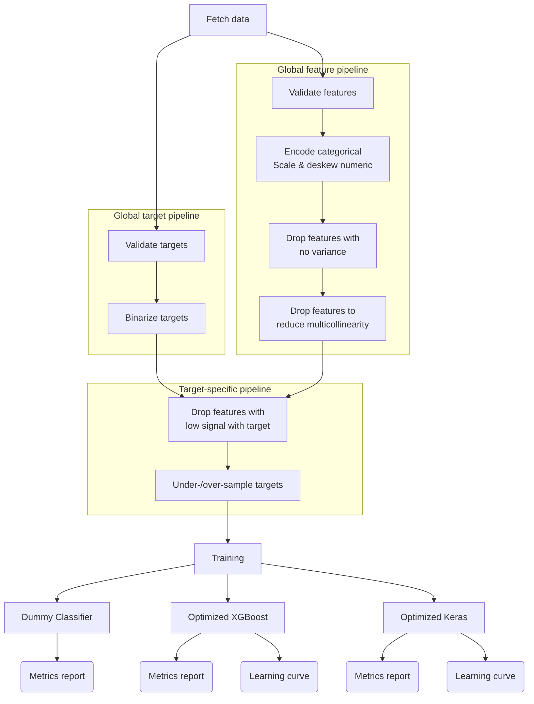

# Project 1

<!--
Table of contents updated via:
uvx --from md-toc md_toc --in-place github -- README.md
-->
<!--TOC-->

-   [Project 1](#project-1)
    -   [Project Structure](#project-structure)

<!--TOC-->

## Project Structure



## Installation

```bash
brew install quarto
```

Or look at [Getting Started with Quarto](https://quarto.org/docs/get-started/).

## Useful commands

```bash
quarto preview hello.qmd

quarto convert document.qmd

quarto render hello.qmd --to html
quarto render hello.qmd --to docx
quarto render hello.qmd --to pdf

# Default is to not execute cells within notebook. Override using:
quarto render notebook.ipynb --execute
```
